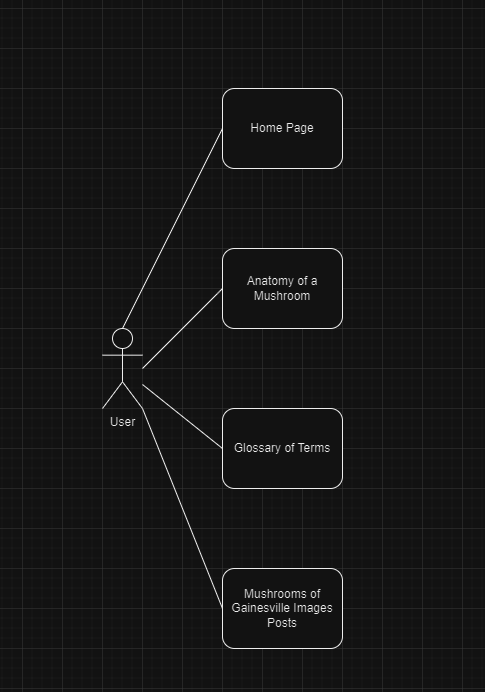

# Mushroom-Website
Website about the mushrooms in Gainesville, Fl

Table of Contents:
[Overview](https://github.com/fChiriboga/Mushroom-Website/blob/main/README.md#overview)
[Solution Architecture Diagram](https://github.com/fChiriboga/Mushroom-Website/blob/main/README.md#solution-architecture-diagram)
[Wireframe Diagrams](https://github.com/fChiriboga/Mushroom-Website/blob/main/README.md#wireframe-diagrams)
[User Stories](https://github.com/fChiriboga/Mushroom-Website/blob/main/README.md#user-stories)
[Initial Use Cases](https://github.com/fChiriboga/Mushroom-Website/blob/main/README.md#initial-use-cases)
[Use Case Diagram](https://github.com/fChiriboga/Mushroom-Website/blob/main/README.md#use-case-diagram)
[Project Requirements Table](https://github.com/fChiriboga/Mushroom-Website/blob/main/README.md#project-requirements-table)

## Overview

This website will be used to create a database on the mushrooms in Gainesville, Florida to help beginner foragers to identify and to learn about the different components of mushrooms. This will be for educational purposes only. There will be information on the anatomy of mushrooms and will show the differences for each part. The database will have components to help the user rule out possibilities by having the user specify the characteristics of the unidentified mushroom. There will also be a list of common edibles and their dangerous look-alikes. The website will also allow users to upload their photos of mushrooms and where they are found. Mushroom hunting can be an enjoyable experience and should be shared among others. This website will help the Gainesville community to increase knowledge of our backyard while maintaining safe practices to avoid unwanted outcomes.

## Solution Architecture Diagram

## Wireframe Diagrams

## User Stories

As a beginner mushroom hunter
I want to know the anatomy of the mushroom
So that I can understand the different components and see what each part looks like.

As a blogger
I want to be able to post images of my finds
So that others can see where I found specific mushrooms.

As a mushroom hunter
I want a list of dangerous look-alikes
So that I can avoid any encounters with harmful mushrooms.

As a mushroom hunter
I want to know the different cap shapes
So that I can know the difference between each type of mushroom cap.

As a mushroom hunter
I want to know some common terminology used
So that I can better understand certain terms.

## Initial Use Cases

1. **Use Case for Understanding Mushroom Anatomy:**
   - **Actor:** Beginner Mushroom Hunter
   - **Scenario:** The beginner mushroom hunter wants to know the different parts of mushrooms.
   - **Result:**  They go to the Mushroom Anatomy page and see the anatomy of a mushroom and what each part does.

2. **Use Case for Posting Images:**
   - **Actor:** Blogger
   - **Scenario:** The blogger wants to post photos of their mushrooms.
   - **Result:** The blogger goes to the user page (third page) and adds their photos to the page.

3. **Use Case for Avoiding Harmful Mushrooms:**
   - **Actor:** Mushroom Hunter
   - **Scenario:** The mushroom hunter wants to avoid mixing up edible mushrooms with harmful look-a-likes.
   - **Result:** On the home page, the mushroom hunter finds a list of look-a-likes to avoid.
  
4. **Use Case for Learning About Different Cap Shapes:**
   - **Actor:** Mushroom Hunter
   - **Scenario:** The mushroom hunter wants to learn about different cap shapes.
   - **Result:** Going to the Mushroom Anatomy page (page 2), they will find a link to learn about the different cap shapes.

5. **Use Case for Learning Common Terminology:**
   - **Actor:** Mushroom Hunter
   - **Scenario:** The mushroom hunter wants to know common terminology used when learning about mushrooms.
   - **Result:** On the home page in the navigation bar, they click the link to the Glossary of Terms page where common terminology will be located.

## Use Case Diagram

## Project Requirements Table

|ID| Requirement                                                                                        | Testable |
|--|----------------------------------------------------------------------------------------------------|----------|
|1 | The website shall have multiple pages and one of them will have information on the anatomy of mushrooms.| Yes |
|2 | The website shall allow users to post images and add the location of those images.| Yes |
|3 | The website shall provide information on dangerous look-a-likes.| Yes |
|4 | The website shall allow users to navigate to different cap shapes of a mushroom.| Yes |
|5 | The website shall allow users to be able to go to a Glossary of Terms.| Yes |
